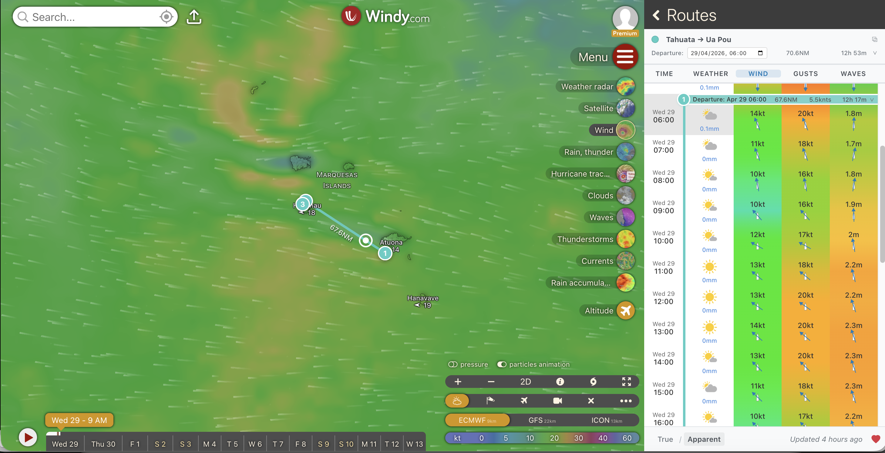
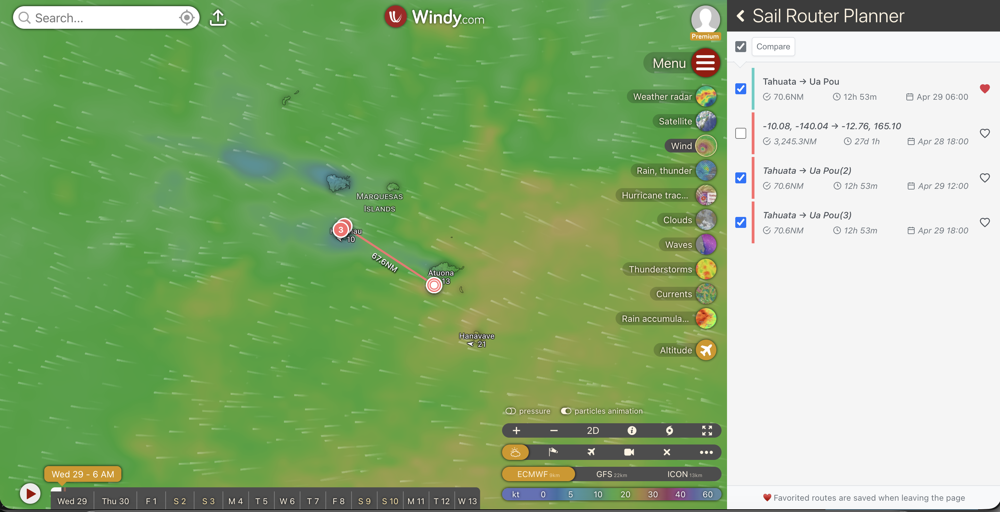
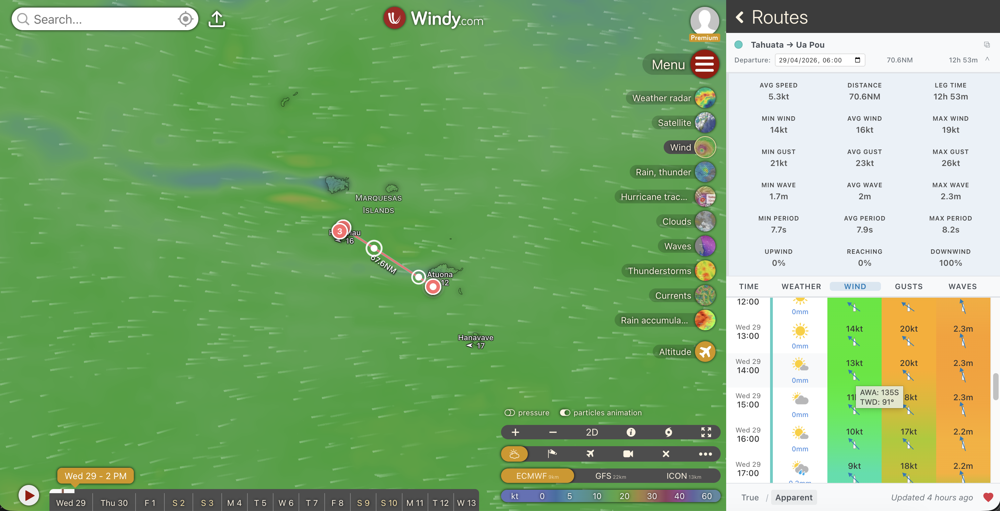
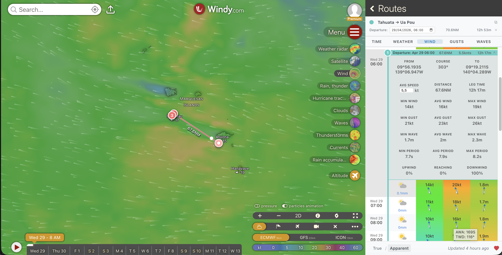
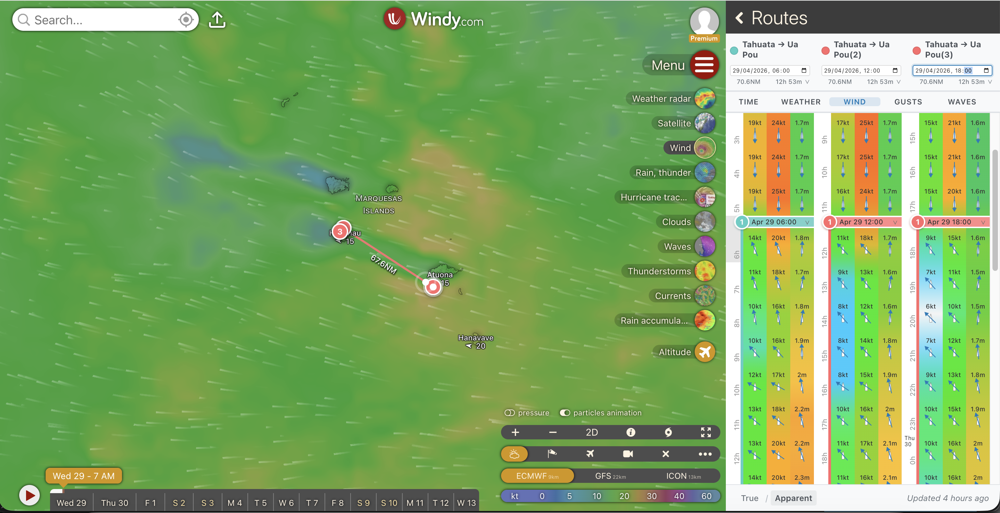
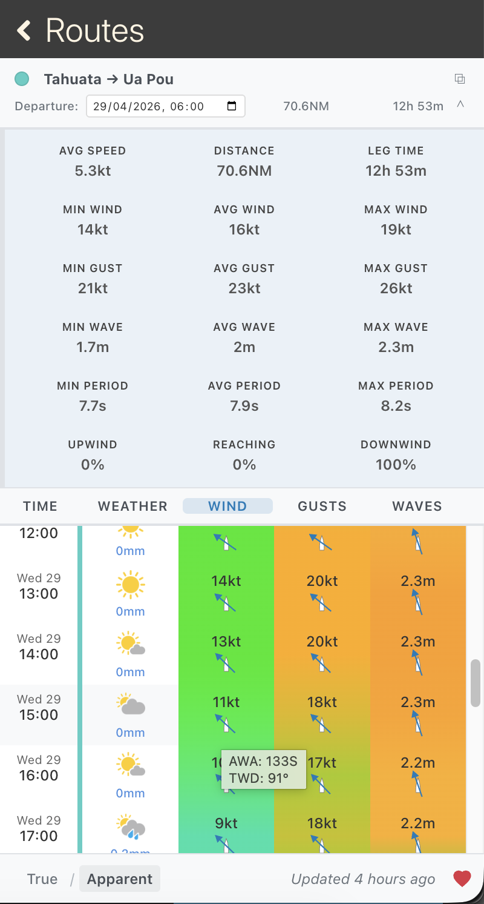
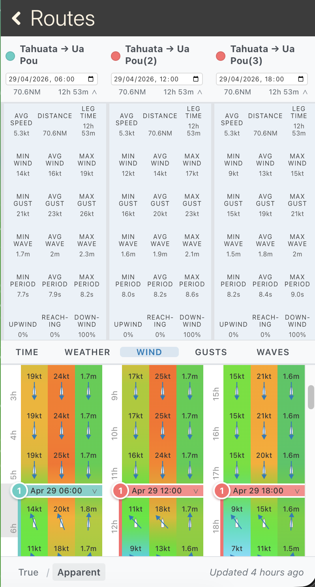

# Sail Router Planner - Windy Plugin ⛵

Professional sailing route planning and weather forecasting plugin for Windy.com. Plan your sailing passages with detailed weather analysis, interactive route editing, and comprehensive sailing-specific forecasts.



## ✨ Key Features

### 🗺️ Interactive Route Planning
- **Click-to-Create Routes**: Simply click on the map to add waypoints with instant route visualization
- **Drag & Drop Editing**: Move waypoints by dragging to optimize your route in real-time
- **Multiple Routes**: Compare different routing options with color-coded routes
- **Great Circle Navigation**: Accurate long-distance routing using Earth's curvature for precise navigation



### 🌤️ Comprehensive Weather Forecasting
- **Hour-by-Hour Analysis**: Complete weather timeline for your entire passage
- **True & Apparent Wind**: Toggle between true wind and apparent wind relative to your boat
- **Multi-Day Support**: Handle passages of any length with proper time management
- **Pre/Post Departure Buffer**: Weather analysis 4 hours before departure and after arrival



### 📊 Sailing-Specific Analytics
- **Leg Weather Statistics**: Detailed analysis for each route segment including:
  - Wind speeds (min/avg/max) and gust analysis
  - Wave heights and periods
  - Wind angle distribution (% upwind/reaching/downwind)
- **Custom Speed Settings**: Set different speeds for each leg with instant recalculation
- **Departure Time Optimization**: Easily adjust departure time to find the best weather window



### 🎯 Multi-Route Comparison
- **Route Duplication**: Easily duplicate any route to compare different options side-by-side
- **Side-by-Side Analysis**: Compare multiple routes and departure times simultaneously
- **Timeline Alignment**: In compare mode, scroll routes up or down to align specific time periods for precise comparison
- **Route Management**: Easy route creation, duplication, and color coding
- **Weather Window Analysis**: Find the optimal departure time across different routing options



## 🚀 Installation

### Method 1: Direct Plugin Installation (Recommended)

1. **Open Windy.com** in your web browser
2. **Click the Menu** (hamburger icon ☰) in the top-left corner
3. **Select "Install Windy plugin"**
4. **Choose "Load plugin from URL"**
5. **Paste this URL:**
   ```
   https://windy-plugins.com/13935398/windy-plugin-sail-router-planner/0.5.0/plugin.min.js
   ```
6. **Click "Load Plugin"**
7. **Access the plugin** via the Plugins menu → "Sail Router Planner"

### Method 2: Development Version
For the latest features (requires technical setup):
```bash
git clone https://github.com/blaaaaaaah/windy-plugin-sail-router-planner.git
cd windy-plugin-sail-router-planner
npm install
npm start
```
Then load `https://localhost:9999/plugin.js` in Windy's developer mode.

## 🧭 How to Use

### 1. Create Your Route
1. **Click on the map** to add your first waypoint (starting point)
2. **Continue clicking** to add additional waypoints along your desired route
3. **Drag waypoints** to fine-tune your path
4. **Set departure time** using the time picker in the route details

### 2. Analyze Weather Conditions
1. **Review the forecast table** showing hour-by-hour weather data
2. **Toggle between True/Apparent wind** using the controls at the bottom
3. **Click on weather column headers** (Wind, Waves, Weather) to change map overlay
4. **Expand waypoint details** to see comprehensive leg statistics

### 3. Optimize Your Route
1. **Adjust leg speeds** by editing the speed values for each route segment
2. **Modify departure time** to find better weather windows
3. **Duplicate routes** to compare different options side-by-side
4. **Align timelines** in compare mode by scrolling routes up or down to compare specific weather periods
5. **Use route colors** to distinguish between different options

## 🌊 Use Cases

### Ocean Passages
Perfect for planning long-distance passages such as:
- **Atlantic Crossings**: Optimize departure timing for trade wind windows
- **Pacific Routes**: Plan multi-week passages with detailed weather analysis
- **Seasonal Migration**: Time your departure for optimal weather patterns

### Coastal Cruising
Ideal for shorter coastal passages:
- **Day Sailing**: Plan perfect day trips with arrival time precision
- **Harbor Hopping**: Multi-stop coastal cruising with weather analysis
- **Weather Window Planning**: Find safe passage windows between ports

### Racing & Performance Sailing
Advanced features for competitive sailing:
- **Route Optimization**: Compare different tactical routes
- **Weather Routing**: Exploit wind patterns and current advantages
- **Apparent Wind Analysis**: Optimize sail selection and trim decisions

## 📱 Screenshots

### Single Route Planning

*Detailed route planning with weather forecast integration*

### Multi-Route Analysis

*Compare multiple routes side-by-side with comprehensive weather data*

## 🔧 Features in Detail

### Weather Data
- **Wind Speed & Direction**: Precise wind forecasts with visual direction indicators
- **Wave Information**: Height, period, and direction relative to your course
- **Weather Conditions**: Precipitation, visibility, and general weather patterns
- **Forecast Quality**: Color-coded indicators showing forecast freshness

### Navigation Features
- **Great Circle Distances**: Accurate nautical mile calculations
- **Course Bearings**: True compass bearings for navigation
- **Time Calculations**: Precise arrival times based on your boat speed
- **Waypoint Management**: Easy addition, deletion, and modification of route points

### User Interface
- **Responsive Design**: Works perfectly on desktop and mobile devices
- **Real-time Updates**: Instant recalculation when you make changes
- **Intuitive Controls**: Natural workflow that matches sailing planning needs
- **Professional Polish**: Smooth animations and loading states

## ⚡ Technical Highlights

- **Windy API Integration**: Direct access to professional weather models
- **Apparent Wind Calculations**: Proper vector mathematics for sailing conditions
- **Statistical Analysis**: Comprehensive weather statistics for passage planning
- **Performance Optimized**: Efficient data processing for smooth operation

## 🆘 Support & Feedback

- **Issues**: Report bugs or request features on [GitHub Issues](https://github.com/blaaaaaaah/windy-plugin-sail-router-planner/issues)
- **Documentation**: Full technical documentation in the repository
- **Updates**: Plugin updates are delivered automatically through Windy

---

**🌊 Start planning your next sailing adventure with professional weather routing!**

*This plugin brings professional-grade sailing route planning to every sailor, combining Windy's world-class weather data with sailing-specific analysis and intuitive route planning tools.*